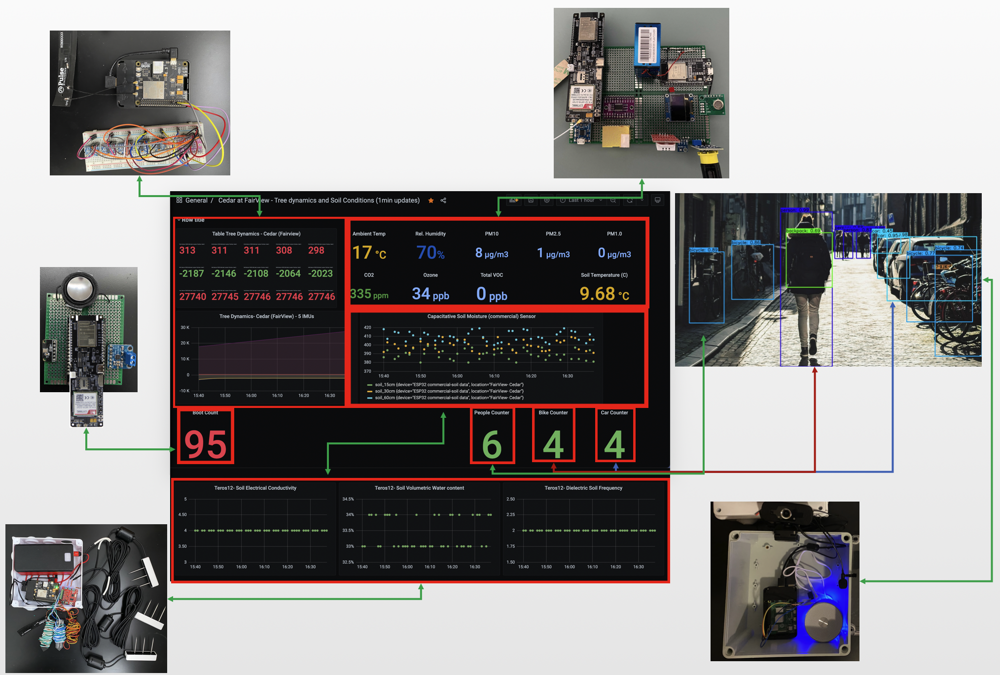
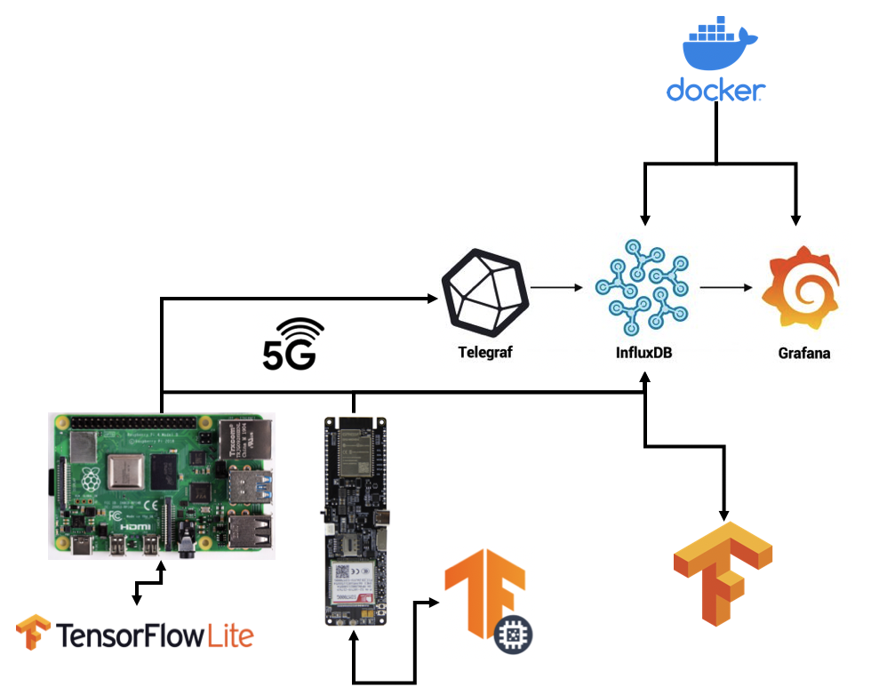

# General framework for a sensors network on campus. 

### to do list
* [x] Phase 1- general architect: connect acceleromter (GY-521 (MPU6050)) to RPi4 and other potential boards (ESP32- LilyGo with sim7000G module)
* [x] Phase 1- general architect: connect sensing devices to Azure IoT Hub
* [x] Phase 1- general architect: Save telemetry data into Azure SQL / CosmosDB
* [x] Phase 1- general architect: Visualize data Power BI
* [x] Phase 1- general architect: connect 5G module
* [x] Phase 1- general architect: connect more sensors
* [x] Phase 1- general architect: add an architect diagram
* [x] Phase 1- general architect: Discuss 2-3 potential use cases in natural assets
* [x] Phase 1- general architect: GDPR, ethical/ data AI approach: fitler data on Edge device before uploading data to Azure
* [x] Phase 1- general architect: Save telemetry data in a influxDB- Docker image 
* [x] Phase 1- general architect: visualize influxDB data -grafana
* [ ] Phase 1- general architect: Save telemetry data in a influxDB- Azure (telegraf)
* [ ] Phase 1- general architect: visualize influxDB data -Azure -grafana

* [x] Phase 1- SSH into RPi over cellular ipv6

* [x] Phase 2- use-case 1 architect: custom/general architect
* [x] Phase 2- use-case 1 architect: obtain use-case specific sensors

* [x] Phase 3- use-case 1 architect: Link this IoT system to other systems (see: custom vision in  repo)
* [x] Phase 3- use-case 1 architect: architect optimzations

# Big Picture: This repo and other repos combined:
\

# General overview - Telemetry (influxDB):
\

## influxdb - docker image:
\

## influxDB --> Visualization on Grafana - docker image:
\

# General overview - Telemetry (custom vision in another repo):
\

# Trying code out:
1. clone repo
2. install dependencies (where relevant)
2. run code specific for each board 
3. ask for connection string: connection strings are linked to our own project (and are typically unshared outside members of the team)
4. set up endpoint through IoT Hub or stream/filter data upload through stream analytics
5. create a SQL database / cosmosDB

## ESP32 setup over 5G network (data storage: SQL databse in Azure):
\

## 3D Real-Time Visualization of the MPU6050:
\

## Setup on RPi4 - GY-521 (MPU6050):
\

## Data uploaded to IoT Hub, passed through Stream Analytics:
\

## (all) Telemetry data into CosmosDB:
\

## Telemetry data in Azure SQL Database:
\

## Setting up Device Twin in Azure:
\

